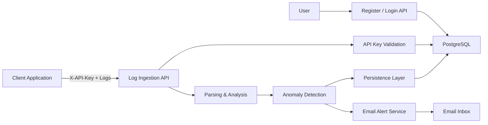
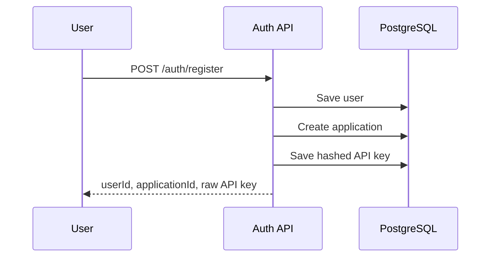
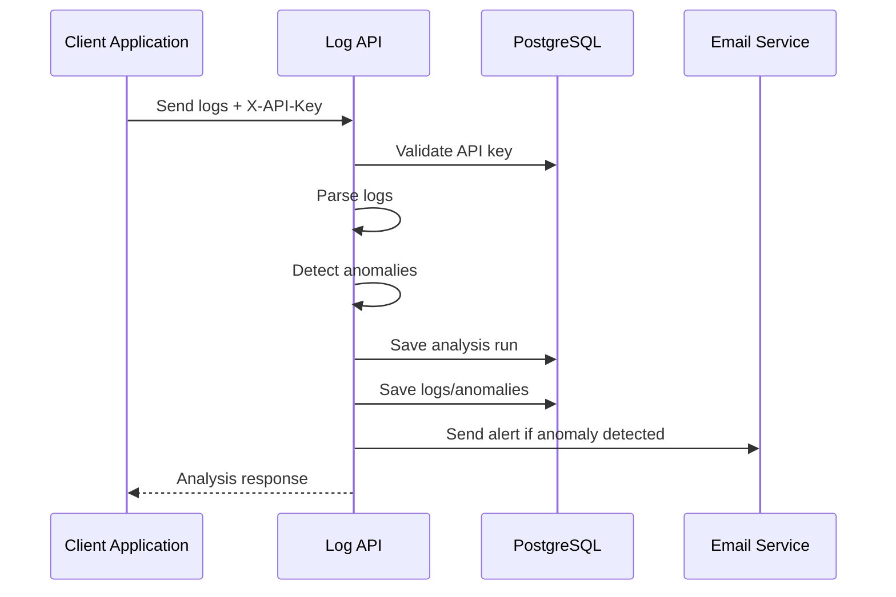
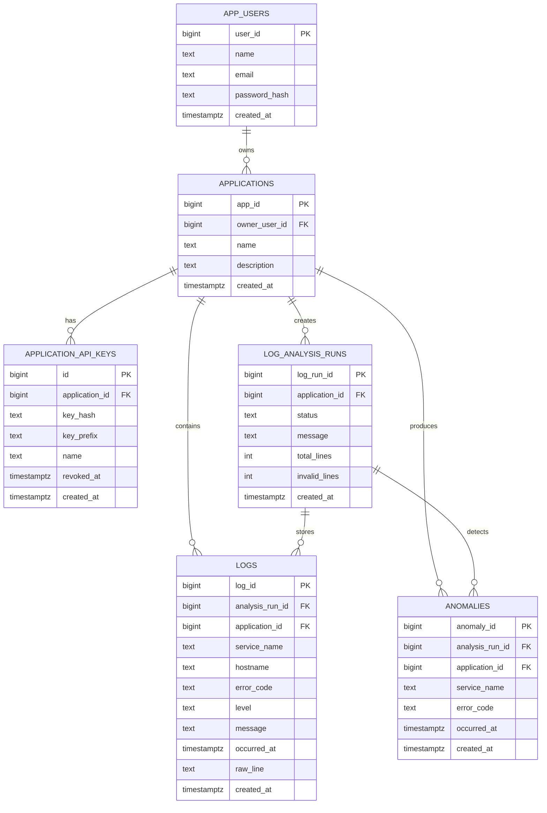

# LogSignals

LogSignals is a backend log monitoring and anomaly detection system built with Java, Spring Boot, and PostgreSQL. It enables external applications to securely submit logs using API keys, supports both file-based and live log ingestion, detects anomalies grouped by service and error code, stores analysis history, and sends email alerts when anomalies are detected.

---

## Why This Project

Modern applications generate large volumes of logs, but raw log data alone is difficult to monitor manually. LogSignals was built to solve that by providing:

- secure application-level log ingestion
- anomaly detection based on service and error code patterns
- persistent analysis history for investigation
- email-based alerting for operational visibility

This project demonstrates practical backend engineering concepts including authentication, API key management, relational schema design, persistent storage, request-driven processing with anomaly-triggered email alerts.

---

## Features

- User registration and login
- Automatic application creation during registration
- API key generation and hashed API key storage
- Secure API key based ingestion for client applications
- File-based log analysis
- Live log ingestion
- Anomaly detection grouped by service and error code
- PostgreSQL-backed persistence for users, applications, API keys, analysis runs, logs, and anomalies
- Email alerting for detected anomalies
- Historical tracking of analysis runs and anomaly records

---

## Tech Stack

- Java
- Spring Boot
- Spring Data JPA
- PostgreSQL
- REST APIs
- Lombok
- JavaMailSender
- Maven

---

## System Architecture


---

##  Registration Flow



---

## Log Ingestion Flow



---

## Database Relationships



---

## API Endpoints
1.Authentication
- POST /auth/register
- POST /auth/login
  
2.Logs
- POST /logs/analyze
- POST /logs/ingest

## Sample Requests
# Register
```json
{
  "name": "Nirmala",
  "email": "nirmala@example.com",
  "password": "password123",
  "applicationName": "Payment Service",
  "applicationDescription": "Logs from payment service"
}
```
# Live Log Ingestion
Header:
```json
X-API-Key: <your-api-key>
```
Body:
```json
{
  "timestamp": "2026-04-28T10:00:00Z",
  "level": "ERROR",
  "service": "payment-service",
  "errorCode": "ERR_500",
  "message": "Payment failed"
}
```
## Project Structure
src/main/java/com/nirmala/logsense
├── config
├── controller
├── dto
├── entity
├── model
├── repository
├── service
└── util

---

## How to Run

# Prerequisites
- Java 17+
- Maven
- PostgreSQL
- IntelliJ IDEA
- pgAdmin or psql
- Gmail App Password for email alerts

# Steps
1. Clone the repository
``` bash
git clone <your-repo-url>
cd <your-project-folder>
```
2. Create database
``` sql
   CREATE DATABASE log_monitoring;
```
3. Run the SQL query from
   ``` text
   database/schema.sql
   ```
4. Configure application.properties
   ``` properties
   spring.datasource.url=jdbc:postgresql://localhost:5432/log_monitoring
spring.datasource.username=your_db_username
spring.datasource.password=your_db_password

spring.datasource.driver-class-name=org.postgresql.Driver

spring.jpa.hibernate.ddl-auto=validate
spring.jpa.show-sql=true
spring.jpa.properties.hibernate.format_sql=true

spring.mail.host=smtp.gmail.com
spring.mail.port=587
spring.mail.username=${MAIL_USERNAME}
spring.mail.password=${MAIL_PASSWORD}
spring.mail.properties.mail.smtp.auth=true
spring.mail.properties.mail.smtp.starttls.enable=true
```
5. Set IntelliJ environment variables for the mail
``` text
MAIL_USERNAME=your_email@gmail.com;MAIL_PASSWORD=your_google_app_password
```
6. Run the Spring Boot application
   For that first select the main app which is LogSenseApplication and then hit Run button.

## How to test
1. Register user

2. Copy returned API key

3. Login user

4. Test /logs/ingest

5. Test /logs/analyze

6. Check PostgreSQL tables

7. Check email inbox


   

  

