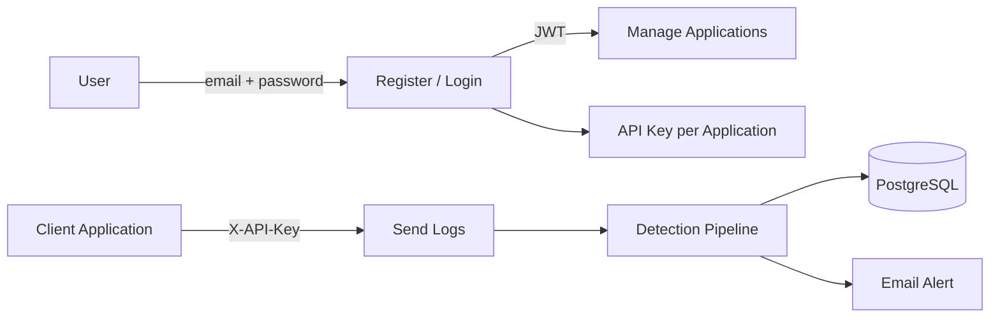
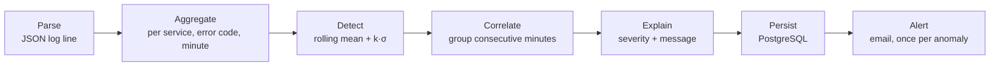
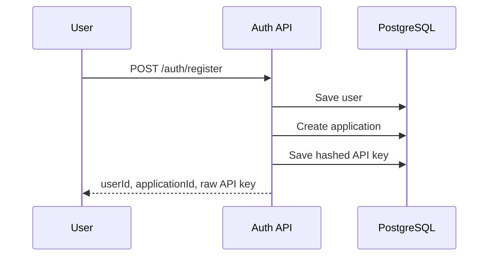
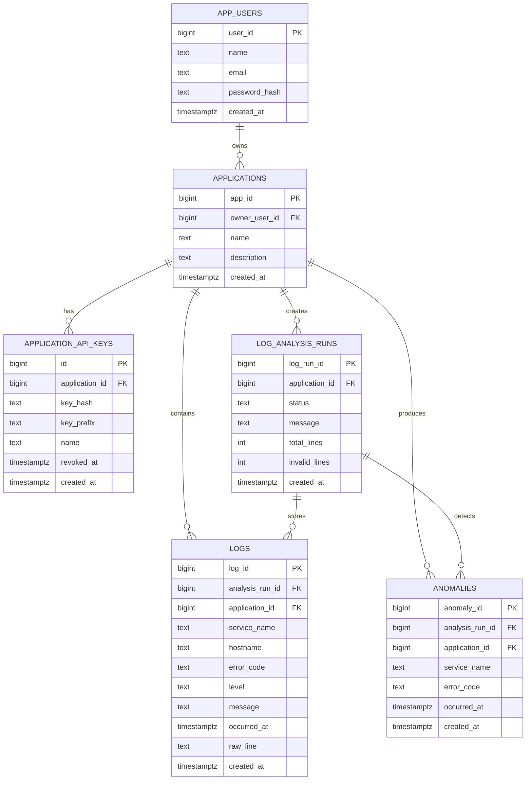
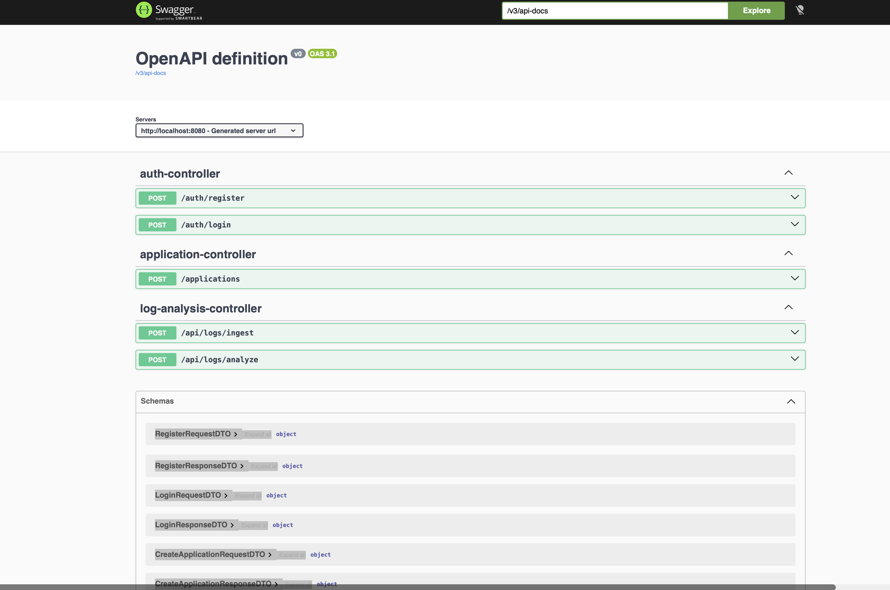
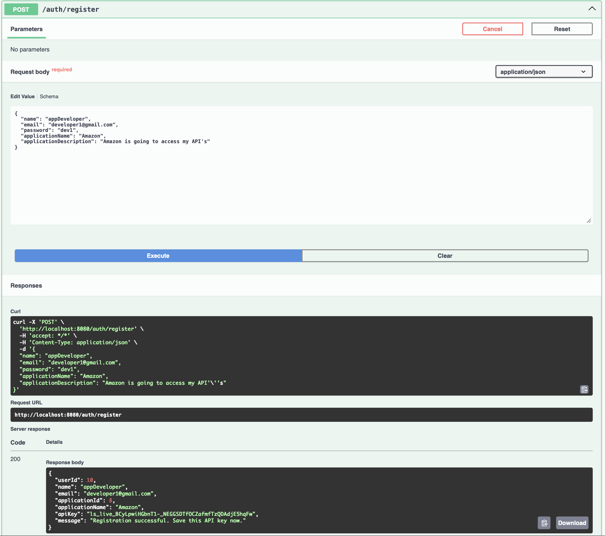
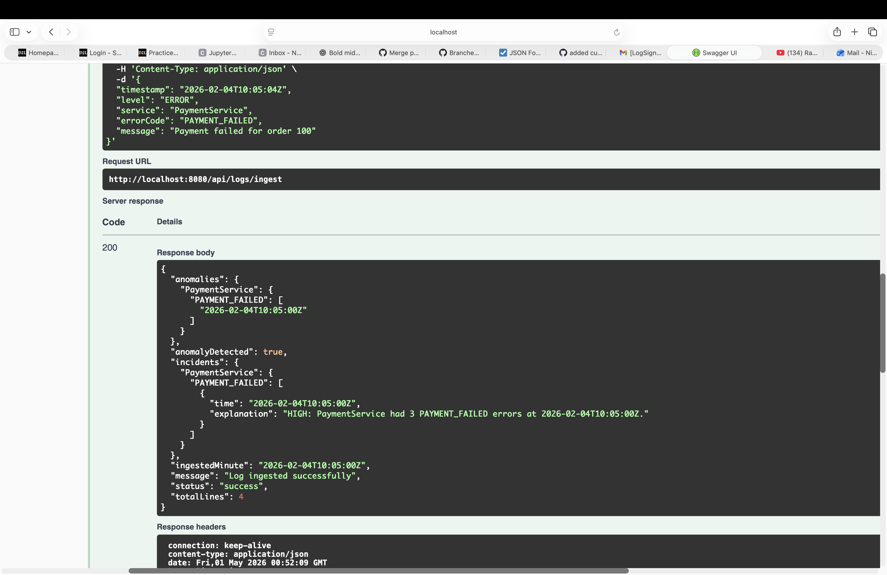
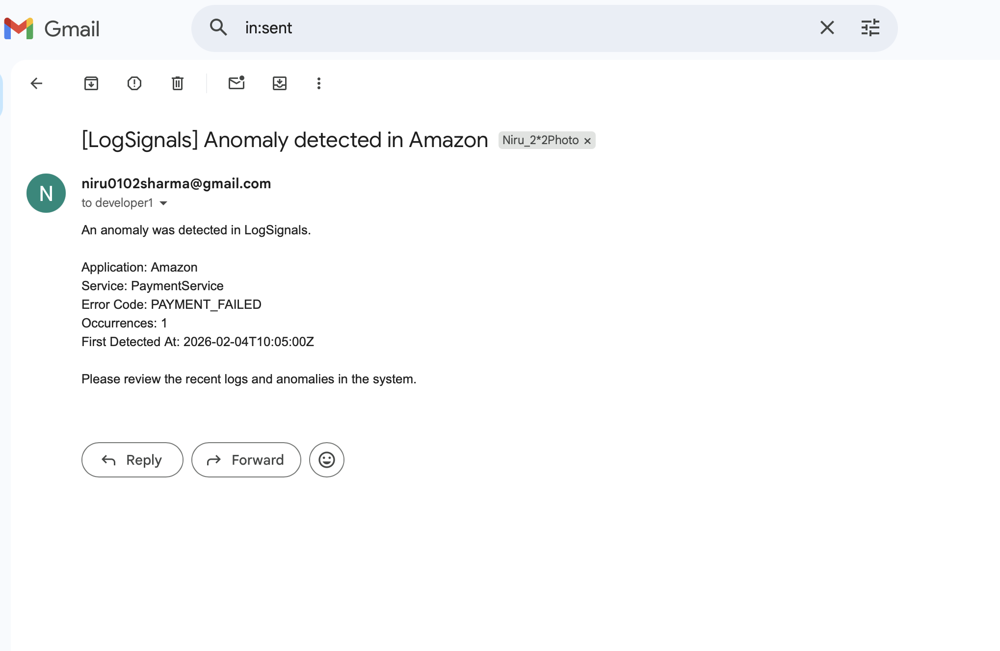

# LogSignals

LogSignals is a backend log monitoring and anomaly detection system built with Java, Spring Boot, and PostgreSQL. It enables external applications to securely submit logs using API keys, supports both file-based and live log ingestion, detects anomalies grouped by service and error code, stores analysis history, and sends email alerts when anomalies are detected.

---

## Why This Project

Modern applications generate large volumes of logs, but raw log data alone is difficult to monitor manually. LogSignals was built to solve that by providing:

- secure application-level log ingestion
- anomaly detection based on service and error code patterns
- persistent analysis history for investigation
- email-based alerting for operational visibility

This project demonstrates practical backend engineering concepts including authentication, API key management, relational schema design, persistent storage, request-driven processing with anomaly-triggered email alerts.

---

## Features

- User registration and login with **JWT** access tokens (HS256)
- Automatic application creation during registration, plus additional applications per user
- API key generation with **SHA-256 hashed** storage (raw key shown only once)
- API key based ingestion for client applications
- **Multi-tenant isolation**: every application's logs, anomalies and live detection state are kept separate
- File-based log analysis and live (one event at a time) log ingestion
- **Rolling statistical anomaly detection** (mean + k·σ) per service and error code
- **Incident correlation**: consecutive anomalous minutes are grouped into a single incident
- **Severity classification** (MEDIUM / HIGH / CRITICAL) with a human-readable explanation
- **Deduplicated email alerts**: each anomaly is stored and emailed once
- Bounded memory for live ingestion (configurable retention window)
- Consistent JSON error responses with correct HTTP status codes (400 / 401 / 404 / 409 / 413)
- PostgreSQL-backed persistence for users, applications, API keys, analysis runs, logs, and anomalies

---

## Tech Stack

- Java
- Spring Boot
- Spring Data JPA
- PostgreSQL
- Maven
- REST APIs
- Swagger / OpenAPI
- JWT (HS256, implemented with JDK HMAC-SHA256)
- BCrypt (password hashing)
- JUnit 5 & Mockito
- Lombok
- JavaMailSender

  
---

## System Architecture


```mermaid
flowchart LR
    U[User] -->|email + password| R[Register / Login]
    R -->|JWT| M[Manage Applications]
    R --> K[API Key per Application]
    C[Client Application] -->|X-API-Key| L[Send Logs]
    L --> P[Detection Pipeline]
    P --> D[(PostgreSQL)]
    P --> E[Email Alert]
```

### Log Processing Pipeline


```mermaid
flowchart LR
    A[Parse<br/>JSON log line] --> B[Aggregate<br/>per service, error code, minute]
    B --> C[Detect<br/>rolling mean + k·σ]
    C --> D[Correlate<br/>group consecutive minutes]
    D --> E[Explain<br/>severity + message]
    E --> F[Persist<br/>PostgreSQL]
    F --> G[Alert<br/>email, once per anomaly]
```

Each stage is a separate Spring component (`LogParser`, `Aggregator`, `AnomalyDetector`, `IncidentCorrelator`, `IncidentExplainer`, `LogPersistenceService`, `AlertNotificationService`), orchestrated by `LogAnalysisService` (file uploads) and `LiveLogIngestionService` (live events).
---

##  Registration Flow


```mermaid
sequenceDiagram
    participant U as User
    participant API as Auth API
    participant DB as PostgreSQL

    U->>API: POST /auth/register
    API->>DB: Save user
    API->>DB: Create application
    API->>DB: Save hashed API key
    API-->>U: userId, applicationId, raw API key

```

---

## Database Relationships


```mermaid
erDiagram
    APP_USERS ||--o{ APPLICATIONS : owns
    APPLICATIONS ||--o{ APPLICATION_API_KEYS : has
    APPLICATIONS ||--o{ LOG_ANALYSIS_RUNS : creates
    APPLICATIONS ||--o{ LOGS : contains
    APPLICATIONS ||--o{ ANOMALIES : produces
    LOG_ANALYSIS_RUNS ||--o{ LOGS : stores
    LOG_ANALYSIS_RUNS ||--o{ ANOMALIES : detects

    APP_USERS {
        bigint user_id PK
        text name
        text email
        text password_hash
        timestamptz created_at
    }

    APPLICATIONS {
        bigint app_id PK
        bigint owner_user_id FK
        text name
        text description
        timestamptz created_at
    }

    APPLICATION_API_KEYS {
        bigint id PK
        bigint application_id FK
        text key_hash
        text key_prefix
        text name
        timestamptz revoked_at
        timestamptz created_at
    }

    LOG_ANALYSIS_RUNS {
        bigint log_run_id PK
        bigint application_id FK
        text status
        text message
        int total_lines
        int invalid_lines
        timestamptz created_at
    }

    LOGS {
        bigint log_id PK
        bigint analysis_run_id FK
        bigint application_id FK
        text service_name
        text hostname
        text error_code
        text level
        text message
        timestamptz occurred_at
        text raw_line
        timestamptz created_at
    }

    ANOMALIES {
        bigint anomaly_id PK
        bigint analysis_run_id FK
        bigint application_id FK
        text service_name
        text error_code
        timestamptz occurred_at
        timestamptz created_at
    }

```
---
## Anomaly Detection Logic

LogSignals uses a rolling threshold based anomaly detection approach rather than a fixed error count rule.

The system groups logs by:
- service
- error code
- minute

It then counts how many times the same error occurs in each minute. To decide whether the current count is anomalous, the system compares it with recent previous counts for the same service and error code.

A dynamic threshold is calculated using the recent mean and standard deviation:

`threshold = mean + (k × standard deviation)`

In the current implementation (configurable in `application.properties`):
- `k = 2` (`logsense.detection.threshold`)
- rolling window = last `5` minutes with errors (`logsense.detection.windowSize`)
- minimum earlier minutes before detection starts = `1` (`logsense.detection.minimumSamples`)
- minimum standard deviation = `1` (`logsense.detection.minimumStandardDeviation`), so a perfectly flat baseline does not make every small increase an anomaly

A minute is anomalous when `current count >= threshold`. Only `ERROR` level logs are counted.

**Example:** a service had 2 errors in an earlier minute. The standard deviation is 0, so the minimum of 1 is used: `threshold = 2 + 2 × 1 = 4`. If the next minute has 4 errors, it is flagged as anomalous.

### From anomalies to alerts

1. **Correlate**: consecutive anomalous minutes for the same service and error code are merged into one incident (e.g. 10:03, 10:04, 10:05 → one incident).
2. **Classify severity** from the total error count of the incident:

   | Errors | Severity |
      |---|---|
   | ≥ 5 | CRITICAL |
   | 3 – 4 | HIGH |
   | < 3 | MEDIUM |

3. **Explain**: e.g. `CRITICAL: PaymentService had 5 PAYMENT_FAILED errors at 2026-02-04T10:07:00Z.`
4. **Persist and alert**: anomalies are saved and the application owner receives an email. In live ingestion, each anomaly is alerted only once.

---

## API Endpoints
1. Authentication
- `POST /auth/register` – creates the user, a default application and its API key
- `POST /auth/login` – returns a signed JWT access token (HS256, 60 min)

2. Applications (requires `Authorization: Bearer <accessToken>`)
- `POST /applications` – creates another application + API key for the logged-in user

3. Logs (requires `X-API-Key: <apiKey>`)
- `POST /api/logs/analyze` – upload a log file (multipart, field `file`)
- `POST /api/logs/ingest` – send a single log event (JSON)

### Error responses
| Status | When |
|---|---|
| 400 | validation failed, invalid JSON, missing file |
| 401 | wrong email/password, missing/invalid/revoked API key, missing/invalid/expired token |
| 404 | referenced user or application does not exist |
| 409 | email already registered, application name already used |
| 413 | uploaded file too large |

### Live ingestion behaviour
- Each application has its own isolated in-memory detection state (no cross-tenant mixing).
- Only the last `logsense.live.retentionMinutes` (default 60) of minute buckets are kept in memory.
- Each anomaly (service + error code + minute) is stored and emailed **once**, not on every subsequent log.

## Sample Requests
### Register
```json
{
  "name": "Nirmala",
  "email": "nirmala@example.com",
  "password": "password123",
  "applicationName": "Payment Service",
  "applicationDescription": "Logs from payment service"
}
```
### Login
```json
{ "email": "nirmala@example.com", "password": "password123" }
```
Response contains `accessToken`, `tokenType` (`Bearer`) and `expiresInSeconds`.

### Create another application
Header:
```text
Authorization: Bearer <accessToken>
```
Body:
```json
{ "name": "Checkout Service", "description": "Checkout logs", "apiKeyName": "prod" }
```
### Live Log Ingestion
Header:
```text
X-API-Key: <your-api-key>
```
Body:
```json
{
  "timestamp": "2026-04-28T10:00:00Z",
  "level": "ERROR",
  "service": "payment-service",
  "errorCode": "ERR_500",
  "message": "Payment failed"
}
```
## Project Structure
```text
src/main/java/com/nirmala/logsense
├── aggregator   # groups error logs per service, error code and minute
├── config       # detection settings, password encoder, JWT and Swagger config
├── controller   # REST endpoints (auth, applications, logs)
├── correlator   # merges consecutive anomalous minutes into incidents
├── detector     # rolling mean + k·σ anomaly detection
├── dto          # request / response objects
├── entity       # JPA entities mapped to PostgreSQL tables
├── exception    # custom exceptions and global error handler
├── explainer    # severity classification and incident explanations
├── model        # internal domain objects (LogModel, AggregationKey, Incident)
├── parser       # parses JSON log lines
├── repository   # Spring Data JPA repositories
├── security     # JWT token issuing and verification
├── service      # orchestration, persistence, auth, alerting
└── util         # API key generation and hashing
```
---

## How to Run

### Requirements
- Java 25
- Maven
- PostgreSQL

### Optional Tools
- IntelliJ IDEA (or any IDE)
- pgAdmin / psql (for database management)

### Steps
1. Clone the repository
``` bash
git clone https://github.com/nirmala-sharma/LogSignals.git
```
2. Create database
``` sql
CREATE DATABASE log_monitoring;
```
3. Run the SQL query from
``` text
database/schema.sql
```
4. Configure application.properties
``` properties
 spring.datasource.url=jdbc:postgresql://localhost:5432/log_monitoring
 spring.datasource.username=your_db_username
 spring.datasource.password=your_db_password

 spring.datasource.driver-class-name=org.postgresql.Driver

 spring.jpa.hibernate.ddl-auto=validate
 spring.jpa.show-sql=true
 spring.jpa.properties.hibernate.format_sql=true

 spring.mail.host=smtp.gmail.com
 spring.mail.port=587
 spring.mail.username=${MAIL_USERNAME}
 spring.mail.password=${MAIL_PASSWORD}
 spring.mail.properties.mail.smtp.auth=true
 spring.mail.properties.mail.smtp.starttls.enable=true
```
5. Set IntelliJ environment variables for mail and token signing
``` text
MAIL_USERNAME=your_email@gmail.com;MAIL_PASSWORD=your_google_app_password;JWT_SECRET=<random string, at least 32 characters>
```
Generate a secret with `openssl rand -base64 32`. If `JWT_SECRET` is not set, a random secret is generated at startup and issued tokens stop working after a restart.
6. Run the Spring Boot application
   For that first select the main app which is LogSenseApplication and then hit Run button.

## How to test
Open Swagger UI at `http://localhost:8080/swagger-ui/index.html`.

1. `POST /auth/register` → copy the returned `apiKey`
2. `POST /auth/login` → copy the returned `accessToken`
3. Click **Authorize** and paste the token into `bearerAuth` and the API key into `apiKeyAuth`
4. `POST /applications` → create another application
5. `POST /api/logs/analyze` → upload `demo_testing_data/testingfile.log`
6. `POST /api/logs/ingest` → send error logs over several minutes to trigger an anomaly
7. Check PostgreSQL tables and your email inbox

Run the unit tests with `mvn test`.

---
## Demo Screenshots

### Swagger UI



### Register API Response



### Live Log Ingestion Response



### Email Alert


---

## Known Limitations

Being explicit about what this project does **not** handle yet:

- **In-memory live state**: live detection history is kept in memory, so it is lost on restart and not shared across multiple instances (a production version would use Redis).
- **Cold start**: an error code seen for the first time has no baseline, so even a large first spike is not flagged.
- **Sparse baseline**: minutes with zero errors are skipped instead of counted as 0, which can skew the baseline.
- **Synchronous alerts**: emails are sent within the request; a slow mail server slows ingestion.
- **No rate limiting** per API key.
- **API key management**: no endpoints yet to list, rotate or revoke keys, and no token refresh.
- **Data protection**: no automatic masking of sensitive data in logs, no retention policy, and HTTPS must be provided by the deployment.

---

## Learning Opportunities

This project can serve as a practical learning resource for beginner backend developers. By exploring or contributing to LogSignals, contributors can gain hands-on experience with:

- layered Spring Boot backend architecture
- REST API design and request/response handling
- JPA entity mapping and database persistence
- relational schema design with PostgreSQL
- API key based application authentication
- dependency injection in Spring Boot
- global exception handling
- unit testing for core backend logic
- log parsing, aggregation, and anomaly detection workflows
- email integration and environment-based configuration

It is a good project for understanding how multiple backend components work together in a real-world monitoring workflow.

## Contribution Ideas

Contributions are welcome in both beginner-friendly and advanced areas.

### Beginner-Friendly

- improve README and project documentation
- add more unit tests
- improve validation and error messages
- clean up naming and code readability
- add more sample log datasets
- improve Swagger/OpenAPI documentation

### Intermediate

- add history retrieval APIs for logs and anomalies
- add endpoints to list, rotate and revoke API keys
- improve severity classification logic
- add better filtering and search support
- enhance email alert formatting

### Advanced

- support multiple alert recipients per application
- make anomaly thresholds configurable per service
- add a dashboard or frontend UI
- containerize the project using Docker
- add role-based access control
- integrate asynchronous alert processing
- event-driven ingestion with Kafka and Redis-backed detection state
- integration tests with Testcontainers and a CI pipeline